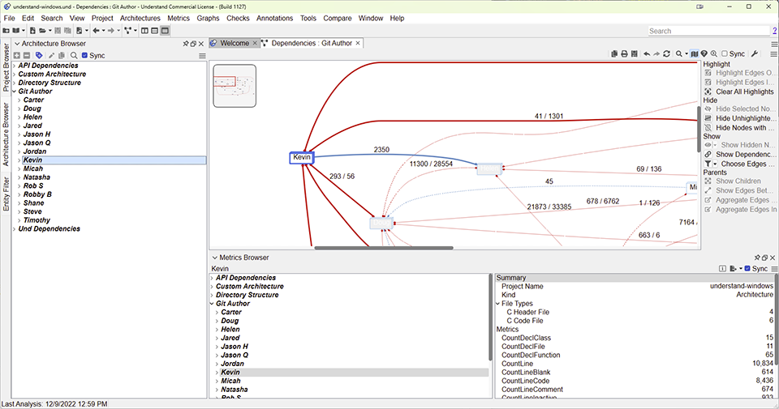
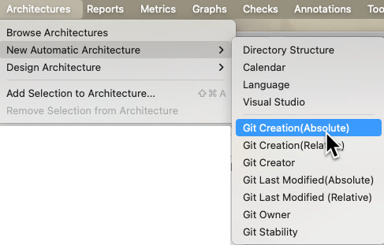

# Overview

Automatic architecture plugins are Python scripts that get run every time you open your Understand project. They allow you to easily create your own architectures that are automatically updated. What can that be used for? Well, anything you want!

*A dependencies graph generated from the [Copyright and License](und://plugin/arch/Copyright%20and%20License) architecture*

Here are a few ideas:
 - Query version control to make an architecture of your most often modified files to [identify churn](und://plugin/arch/Git%20Stability).
 - automatically partition your files based on folder structure or file names
 - make an architecture that quickly separates 3rd party libraries from your teams code

For example, [Git Author](und://plugin/arch/Git%20Author) queries Git to find the last person to edit each file, and makes an Architecture from that. I can then use that architecture to see who owns the file I'm looking at, explore dependencies based on author, or even see who's code is the most complex!

## Running Architectures

Architecture plugins are like an interface that can be used multiple times. For example, you can create a New Automatic Architecture with the [Git Date](und://plugin/arch/Git%20Date) plugin twice, once for the last modified date and once for the created date. Create architecture plugins directly from the plugin manager with the "Run" button.

Or, access your enabled plugins from Architectures -> New Automatic Architectures.

You can view and edit your architectures by selecting Architectures -> Browse Architectures

## Writing Your Own Plugins

The [Long Name](und://plugin/arch/Long%20Name) automatic architecture plugin is the sample template shown in the [Understand Python API Documentation &#8599;](https://docs.scitools.com/manuals/python/arch.html). There is also a [tutorial &#8599;](https://scitools.freshdesk.com/support/solutions/articles/70000582855) on writing scripts. Keep in mind that even though architectures are generated on background threads, some features that use architectures may not be available until all architectures have finished.

### Plugin Developper Tips

1. Any time a change is made to a plugin file, the plugin scripts cache must be refreshed using the "Refresh" button in the bottom left of the plugin manager.

2. When using "Customize" to make a new plugin, make sure to give it a new name so that it does not clash with the existing architecture plugin. A customized plugin will not appear in the Plugin Manager until scripts have been refreshed, and must be enabled to be accessible from the Understand GUI. A plugin will only be visible in the Plugin Manager if it had no syntax errors.
3. To install a plugin from another location, use the "Add Plugin" button at the bottom left of the Plugin Manager. Or drag and drop the file onto Understand.

4. Understand uses the [per-interpreter GIL feature &#8599;](https://peps.python.org/pep-0684/) that was introduced in Python 3.12 to allow multiple threads to access their own Python interpreter concurrently. The per-interpreter GIL configuration is incompatible with modules that use [single-phase initialization  &#8599;](https://docs.python.org/3/c-api/module.html#single-phase-initialization). This means that plugins should only import native modules that support multi-phase initialization.

