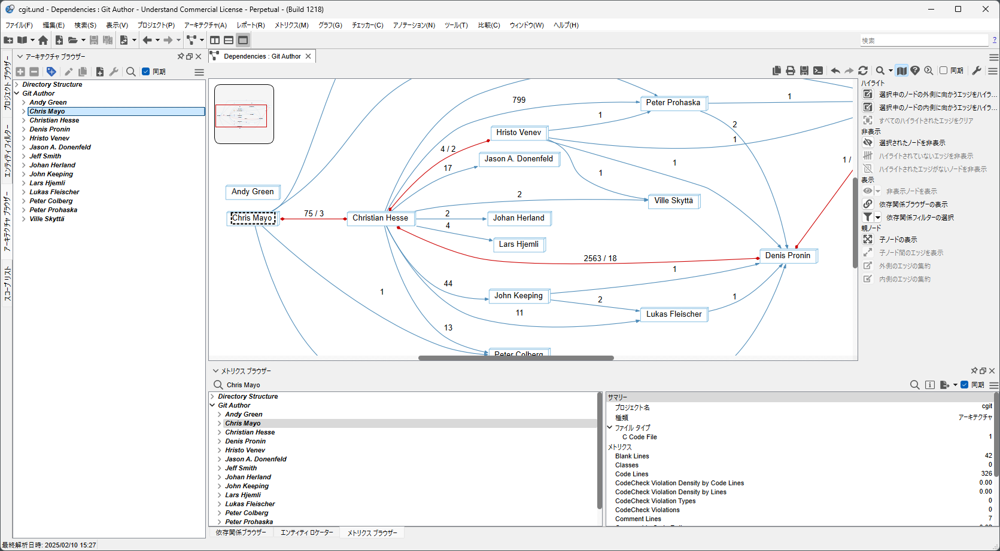
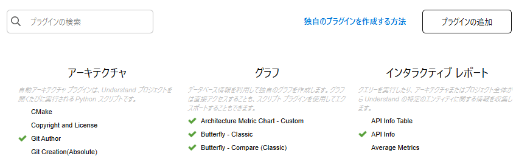
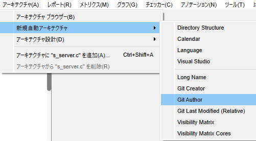

# 自動アーキテクチャ

自動アーキテクチャプラグインは、Understandプロジェクトを開くたびに実行されるPythonスクリプトです。自動的に更新される独自のアーキテクチャを作成することもできます。ご自身のプラグインを作成することで、様々な要求に答えられるとても便利な機能です。

いくつかのアイデアを紹介します:
 - バージョン管理システムを利用して、もっとも頻繁に変更されるファイルのアーキテクチャを作成し、変更の頻度を特定する。
 - ファイルをフォルダー構造やファイル名に基づいて自動的に分割する。
 - 自作のコードとサードパーティライブラリを迅速に分離するアーキテクチャを作成する。

例えば、[arch_last_author.upy](../Solutions/git/arch_last_author.upy) は、Gitに問い合わせて各ファイルを最後に編集した人を見つけ、それからアーキテクチャを作成します。これを使用することで、ファイルの所有者を確認したり、作成者に基づいた依存関係を探索したり、誰のコードがもっとも複雑なのかなどを確認することができます。

## インストール
アーキテクチャプラグインをインストールするには、[ツール] -> [プラグインの管理] を選択し、[プラグインの追加] をクリックします。
一度アーキテクチャプラグインを追加し、有効化すると、[アーキテクチャ] -> [新規自動アーキテクチャ]から、作成した自動アーキテクチャを作成することができます。
[アーキテクチャ] -> [アーキテクチャ ブラウザー]から作成したアーキテクチャを確認することができます。

 

## パフォーマンス
これらのアーキテクチャスクリプトは、プロジェクトが開く際に実行されます。スクリプトの実行中、Understandは実質的にフリーズした状態になります。プロジェクトを開く際に長時間待たされないように、スクリプトは迅速に完了するものを作成することを強くお勧めします。

