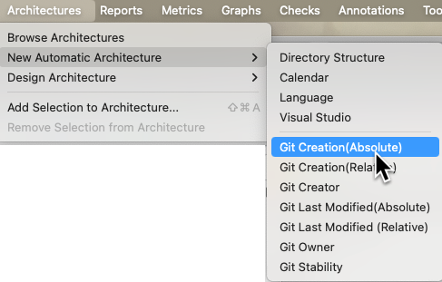

# Automatic Architectures

Automatic architecture plugins are Python scripts that get run every time you open your Understand project. They allow you to easily create your own architectures that are automatically updated. What can that be used for? Well, anything you want!

Here are a few ideas:
 - Query version control to make an architecture of your most often modified files to identify churn.
 - automatically partition your files based on folder structure or file names
 - make an architecture that quickly separates 3rd party libraries from your teams code

For example, [arch_last_author.upy](../Solutions/git/arch_last_author.upy) queries git to find the last person to edit each file, and makes an Architecture from that. I can then use that architecture to see who owns the file I'm looking at, explore dependencies based on author, or even see who's code is the most complex!

## Installation
To install an Architecture plugin, select Tools->Plugin Manager and Add Plugin.  
Once the Architecture plugin is added and enabled, you can create a new instance of the automatic architecture by selecting Architectures -> New Automatic Architectures.  
You can view your new Architecture by select Architectures -> Browse Architectures

 

## Performance
Keep in mind that the project won't open completely until these architecture scripts finish running. During that time, Understand is essentially frozen. You will definitely want to make scripts that finish quickly so you don't have long waits opening the project.

