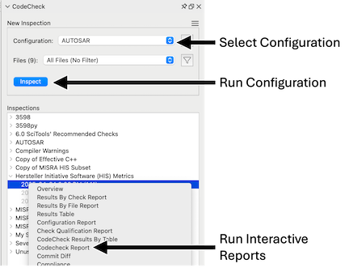

# Overview

CodeCheck check scripts are special Perl and Python scripts that let you provide custom checks for verifying your team's coding standards. They can be used to verify naming guidelines, metric requirements, published best practices, or any other rules or conventions that are important for your team. To learn more about checks, see the [README &#8599; ](https://github.com/stinb/plugins/tree/main/CodeCheck#readme) in the plugin repository.

CodeCheck checks are grouped together into Configurations. For example, there are configurations for published standards such as [AUTOSAR](und://plugin/config/AUTOSAR).

A CodeCheck configuration can be run in the background to automatically update after every analysis. Violations from background configurations are visible in the editor and Violation Browser:

## Running Configurations in the Background

Some plugins such as the [HIS NOMV](und://plugin/metric/HISNOMV) metric and the [Unused Code](und://plugin/ireport/Unused%20Code%20Report) require running specific checks in the background. You can find configurations for these checks in the Plugin Manager and set them to run in the background using the dropdown arrow next to the run button.

You can also set them from Checks -> Select Checks using the context menu if they've been enabled.

## Running Configurations Manually

When CodeCheck configurations are run directly, they are saved as inspections. An inspection is a snapshot of violations at a particular time, and won't update when the project changes. But you can compare inspections across time and generate graphs and interactive reports for them. See the [Codecheck Report](und://plugin/ireport/Codecheck%20Report) for an example interactive report.

Use the "Run" button in the plugin manager to run CodeCheck. Or open CodeCheck with Checks -> Open CodeCheck and run enabled configurations from the top panel.

## Writing Configurations

Creating your own CodeCheck configurations is done from Checks -> Select Checks. Copy an existing configuration or create a brand new one. Clicking the Customize button in the plugin manager will copy the configuration for you.
