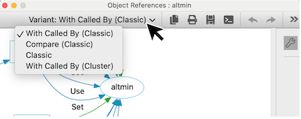
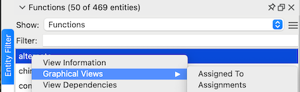
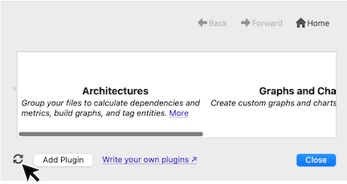

# Overview

Graph plugins allow users to develop their own custom graphs addressing specific information needs. Many built-in graphs began as plugins, such as the [Butterfly](und://plugin/graph/Butterfly-Classic), [Variable Tracker](und://plugin/graph/Variable%20Tracker-Custom), [Control Flow](und://plugin/graph/Control%20Flow-Custom) and [UML Class Diagram](und://plugin/graph/UML%20Class%20Diagram-Custom). Graph plugins can also use layouts other than the default [Graphviz Dot &#8599;](https://graphviz.org/docs/layouts/dot/) layout, such as the [Graphviz SFDP  &#8599;](https://graphviz.org/docs/layouts/sfdp/) layout used to make the File Dependencies Graph and some [chart layouts &#8599;](https://github.com/stinb/plugins/blob/main/Graph/Charts/README.md) provided by Understand.

*The [Lines Bar Chart](und://plugin/graph/Lines%20Bar%20Chart-Custom) graph plugin*

## Running Graphs

Graphs can be generated for the entire Project, Architectures, Entities, and CodeCheck Inspections. Use the Target tags to see the target(s) available for each graph. Enable graph plugins to access them from the Understand GUI.

Graph plugins have both a name and a variant. Graphs with the same name are combined in the "Graphical Views" menu and open a default variant. So, to see a plugin, you may need to change the variant after the graph is open. For example, the "Object References" graph name has three plugin variants ( [Classic](und://plugin/graph/Object%20References-Classic), [With Called By (Classic)](und://plugin/graph/Object%20References-With%20Called%20By%20%28Classic%29), and [Compare (Classic)](und://plugin/graph/Object%20References-Compare%20%28Classic%29) )  and one built-in variant (With Called By (Custom)). Use the Variant drop down to toggle between them.

Plugin graphs that do not specify a variant (style function) will have the variant "Custom". The variant drop down will only be visible if there is more than one variant available.

### Project Graphs

Project graphs available for the current project can be run directly from the plugin manager with the "Run" button.

Enabled project graphs available for the current project are accessed from the Graphs -> Project Graphs menu.

### Architecture Graphs

If a graph plugin is not available for the current project but is available for a root architecture, then the "Run" button in the plugin manager will run the graph for that root architecture.

Enabled and available architecture graphs are shown in the right-click menu of an Architecture under the "Graphical Views" submenu. View your architectures from Architectures -> "Browse Architectures".

### Entity Graphs

Right click on an entity and use the "Graphical Views" submenu to view available graphs. A plugin graph must be enabled and apply to the current entity to be visible. A great way to find entities for a graph plugin is to use the Entity Filter (View -> Entity Filter). For example, a graph that has the "Target: Functions" tag will most likely be available for an entity in the "Functions" entity filter. Note that many graphs have additional requirements, such as a function that has a call reference. So a graph plugin will not necessarily be available for every entity of the target type.

### CodeCheck Graphs

Graphs that target CodeCheck Inspections are only available from interactive report plugins and are not currently available from the GUI.

## Writing Your Own Plugins

The [Calls - Python Sample Template](und://plugin/graph/Calls-Python%20Sample%20Template) graph plugin is the sample template shown in the [Understand Python API Documentation &#8599;](https://docs.scitools.com/manuals/python/graph.html). There is also a [blog article &#8599;](https://blog.scitools.com/making-a-custom-call-tree/) for that graph plugin and a general [tutorial &#8599;](https://scitools.freshdesk.com/support/solutions/articles/70000582855) on writing scripts.

### Plugin Developper Tips

1. Any time a change is made to a plugin file, the plugin scripts cache must be refreshed using the "Refresh" button in the bottom left of the plugin manager.

2. When using "Customize" to make a new plugin, make sure to give it a new name or variant (style) so that it does not clash with the existing graph plugin. A customized plugin will not appear in the Plugin Manager until scripts have been refreshed, and must be enabled to be accessible from the Understand GUI. A plugin will only be visible in the Plugin Manager if it had no syntax errors.
3. To install a plugin from another location, use the "Add Plugin" button at the bottom left of the Plugin Manager. Or drag and drop the file onto Understand.

4. Understand uses the [per-interpreter GIL feature &#8599;](https://peps.python.org/pep-0684/) that was introduced in Python 3.12 to allow multiple threads to access their own Python interpreter concurrently. The per-interpreter GIL configuration is incompatible with modules that use [single-phase initialization  &#8599;](https://docs.python.org/3/c-api/module.html#single-phase-initialization). This means that plugins should only import native modules that support multi-phase initialization.
