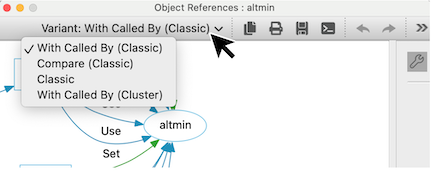
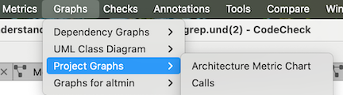
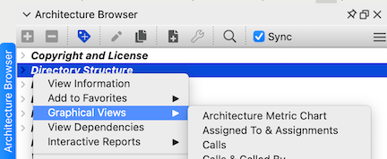
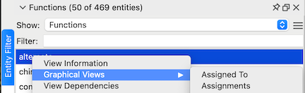

# 概要

グラフプラグインを使うと、特定の情報ニーズに対応するカスタムグラフを独自に開発できます。多くの組み込みグラフは、[Butterfly](und://plugin/graph/Butterfly-Classic)、[Variable Tracker](und://plugin/graph/Variable%20Tracker-Custom)、[Control Flow](und://plugin/graph/Control%20Flow-Custom)、[UML Class Diagram](und://plugin/graph/UML%20Class%20Diagram-Custom) のように、プラグインとして始まりました。グラフプラグインは、デフォルトの [Graphviz Dot &#8599;](https://graphviz.org/docs/layouts/dot/) レイアウト以外も使用でき、ファイル依存関係グラフの作成に使われる [Graphviz SFDP  &#8599;](https://graphviz.org/docs/layouts/sfdp/) レイアウトや、Understand が提供するいくつかの [チャートレイアウト &#8599;](https://github.com/stinb/plugins/blob/main/Graph/Charts/README.md) なども利用できます。

*[Lines Bar Chart](und://plugin/graph/Lines%20Bar%20Chart-Custom) グラフプラグイン*

## グラフの実行

グラフはプロジェクト全体、アーキテクチャ、エンティティに対して生成できます。各グラフで利用可能なターゲットを確認するには、Target タグを使用します。Understand の GUI からアクセスするには、グラフプラグインを有効化します。

グラフプラグインには「名前」と「類別」の両方があり、同じ名前のグラフは「グラフィカルビュー」メニューでまとめて表示され、既定の類別が開かれます。したがって、プラグインを確認するには、グラフを開いた後に類別を変更する必要がある場合があります。たとえば、「Object References」というグラフ名には、3つのプラグイン類別（[Classic](und://plugin/graph/Object%20References-Classic)、[With Called By (Classic)](und://plugin/graph/Object%20References-With%20Called%20By%20%28Classic%29)、[Compare (Classic)](und://plugin/graph/Object%20References-Compare%20%28Classic%29)）と、1つのビルトインの類別（With Called By (Custom)）があります。類別のドロップダウンを使って切り替えます。

類別（スタイル関数）を指定していないプラグインのグラフは、類別が「Custom」になります。類別のドロップダウンは、利用可能な類別が複数ある場合にのみ表示されます。

### プロジェクト グラフ

現在のプロジェクトで利用可能なプロジェクトグラフは、「プラグインの管理」の「実行」ボタンから直接実行できます。

現在のプロジェクトで利用可能な有効化済みのプロジェクトグラフは、「グラフ」 -> 「プロジェクト グラフ」 メニューからアクセスできます。

### アーキテクチャ グラフ

現在のプロジェクトでは利用できないグラフプラグインであっても、ルートアーキテクチャでは利用可能な場合、「プラグインの管理」の「実行」ボタンはそのルートアーキテクチャに対してグラフを実行します。

有効化され利用可能なアーキテクチャのグラフは、アーキテクチャを右クリックした際の「グラフィカルビュー」サブメニューに表示されます。アーキテクチャは、「アーキテクチャ」 -> 「アーキテクチャ ブラウザー」から閲覧できます。

### エンティティ グラフ

エンティティを右クリックして「グラフィカルビュー」サブメニューを使うと、利用可能なグラフを表示できます。プラグインのグラフは有効化され、かつ現在のエンティティに適用可能である場合にのみ表示されます。グラフプラグインに適したエンティティを見つけるには、エンティティ フィルター（「表示」 -> 「エンティティ フィルター」）を使う方法が有効です。たとえば、「Target: Functions」タグを持つグラフは、「Functions」のエンティティフィルターに含まれるエンティティで利用できる可能性が高いです。多くのグラフには追加要件（例：呼び出し参照を持つ関数）がある点にご注意ください。したがって、ターゲット種別のすべてのエンティティでプラグインのグラフが必ずしも利用可能とは限りません。

## 独自のプラグインを作成する

[Calls - Python Sample Template](und://plugin/graph/Calls-Python%20Sample%20Template) のグラフプラグインは、[Understand Python API Documentation &#8599;](https://docs.scitools.com/manuals/python/graph.html) に掲載されているサンプルテンプレートです。そのグラフプラグインに関する [ブログ記事 &#8599;](https://blog.scitools.com/making-a-custom-call-tree/) と、スクリプト作成全般に関する [チュートリアル &#8599;](https://understand.techmatrix.jp/understand-70-pythonapi-tutorial-1/) もあります。

### カスタムプラグイン作成時のヒント

1. プラグインファイルに変更を加えた場合は、その都度、プラグインの管理の左下にある「更新」ボタンを使ってプラグインスクリプトのキャッシュを更新する必要があります。

2. 「カスタマイズ」を使って新しいプラグインを作成する際は、既存のアーキテクチャ・プラグインと衝突しないよう、新しい別の名前を付ける必要があります。カスタマイズしたプラグインは、スクリプトを更新するまでプラグインの管理に表示されません。また、Understand の GUI からアクセスできるようにするには有効化する必要があります。さらに、プラグインに文法エラーがある場合はプラグインの管理に表示されません。
3. 別の場所からプラグインをインストールするには、プラグインの管理の左下の「プラグインの追加」ボタンを使用するか、ファイルを Understand にドラッグ＆ドロップします。

4. Understand は、Python 3.12 で導入された [per-interpreter GIL feature &#8599;](https://peps.python.org/pep-0684/) を利用して、複数のスレッドがそれぞれ自分専用の Python インタプリタに同時にアクセスできるようにしています。per-interpreter GIL の構成は [single-phase initialization  &#8599;](https://docs.python.org/3/c-api/module.html#single-phase-initialization) を使用するモジュールとは互換性がありません。つまり、プラグインではマルチフェーズ初期化をサポートするネイティブモジュールのみをインポートする必要があります。
