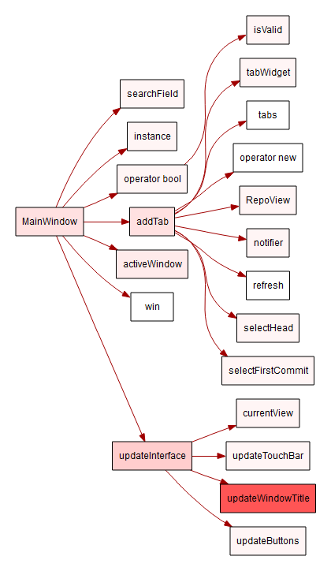

# Overview
The ability to draw custom graphs is a core feature of the Understand Python API. Using the Understand Plugin system, advanced users can develop their own custom graphs addressing specific information needs.  
After enabling a graph, project level graphs can be run by selecting Graphs->Project Graphs -> [Plugin Name]. Entity Specific graphs can be run by selecting the entity and then Graphs -> Graphs for [Entity Name] -> [Plugin Name].  

# Making Your Own Custom Graphs
You can customize any of these graphs, or make your own from scratch. We recommend starting with our [graph plugin example](https://documentation.scitools.com/html/python/graph.html), designed for that purpose. The full Graph API documentation is accessible 
in Understand by selecting Help->Python API Documentation and navigating to the Graphs section. There are also several tutorials on building graphs on our [support site](https://support.scitools.com).  

# Bonus
Check out the [Gephi Extract](https://blog.scitools.com/create-beautiful-overview-graphs-of-your-code/) for an an amazing overview graph option.

