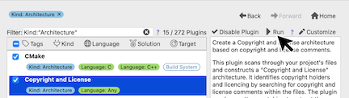
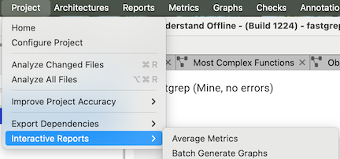
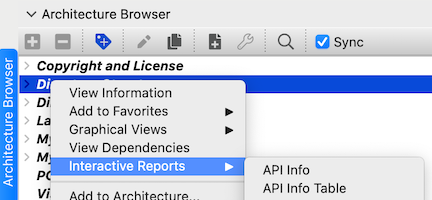
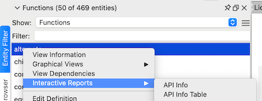

# Overview

Interactive Reports are plugins that create a text-based window in Understand to display information of your choosing. They can reference the entire Project, a given Architecture, a specific entity or CodeCheck Inspections, and they can be as simple or complex as your imagination.

*The [Git Authors](und://plugin/ireport/Git%20Authors) ireport plugin*

## Running Interactive Reports

Use the Target tags to see the target(s) available for each interactive report. Enable interactive report plugins plugins to access them from the Understand GUI.

### Project Interactive Reports

Project Interactive Reports available for the current project can be run directly from the plugin manager with the "Run" button.

Enabled project interactive reports available for the current project are accessed from Project -> "Interactive Reports" and Reports -> "Interactive Reports" menus.

### Architecture Interactive Reports

If an Interactive Report plugin is not available for the current project but is available for a root architecture, then the "Run" button in the plugin manager will run the report for that root architecture.

Enabled and available architecture Interactive Reports are shown in the right-click menu of an Architecture under the "Interactive Reports" submenu. View your architectures from Architectures -> "Browse Architectures".

### Entity Interactive Reports

Right click on an entity and use the "Interactive Reports" submenu to view available reports. A plugin report must be enabled and apply to the current entity to be visible. A great way to find entities for a report plugin is to use the Entity Filter (View -> Entity Filter). For example, a report that has the "Target: Functions" tag will most likely be available for an entity in the "Functions" entity filter. Note that reports may have additional requirements, such as a function that has a call reference. So a report plugin will not necessarily be available for every entity of the target type.

### CodeCheck Inspection Interactive Reports

View available CodeCheck inspections from Checks -> Open CodeCheck. Right click on an open inspection to view available reports which include both built-in and interactive report plugins. An interactive report plugin must be enabled and apply to the given inspection to be visible.

## Writing Your Own Plugins

The [Print Name](und://plugin/ireport/Print%20Name) interactive report plugin is the sample template shown in the [Understand Python API Documentation &#8599;](https://docs.scitools.com/manuals/python/ireport.html). There is also a [tutorial &#8599;](https://scitools.freshdesk.com/support/solutions/articles/70000582855) on writing scripts.

### Plugin Developper Tips

1. Any time a change is made to a plugin file, the plugin scripts cache must be refreshed using the "Refresh" button in the bottom left of the plugin manager.

2. When using "Customize" to make a new plugin, make sure to give it a new name so that it does not clash with the existing interactive report plugin. A customized plugin will not appear in the Plugin Manager until scripts have been refreshed, and must be enabled to be accessible from the Understand GUI. A plugin will only be visible in the Plugin Manager if it had no syntax errors.
3. To install a plugin from another location, use the "Add Plugin" button at the bottom left of the Plugin Manager. Or drag and drop the file onto Understand.

4. Understand uses the [per-interpreter GIL feature &#8599;](https://peps.python.org/pep-0684/) that was introduced in Python 3.12 to allow multiple threads to access their own Python interpreter concurrently. The per-interpreter GIL configuration is incompatible with modules that use [single-phase initialization  &#8599;](https://docs.python.org/3/c-api/module.html#single-phase-initialization). This means that plugins should only import native modules that support multi-phase initialization.
