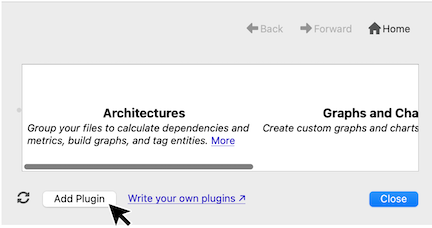

# 概要

インタラクティブレポートは、任意の情報を表示するためのテキストベースのウィンドウを Understand 内に作成するプラグインです。プロジェクト全体、特定のアーキテクチャ、特定のエンティティを参照でき、アイデア次第でシンプルにも複雑にもできます。

*[Git Authors](und://plugin/ireport/Git%20Authors) インタラクティブレポート プラグイン*

## インタラクティブ レポートの実行

各インタラクティブレポートで利用可能なターゲットを確認するには、Target タグを使用します。Understand の GUI からアクセスするには、インタラクティブレポートのプラグインを有効化してください。

### プロジェクト インタラクティブ レポート

現在のプロジェクトで利用可能なプロジェクト インタラクティブレポートは、「プラグインの管理」の「実行」ボタンから直接実行できます。

現在のプロジェクトで利用可能な有効化済みのプロジェクト向けインタラクティブレポートには、「プロジェクト」 -> 「インタラクティブ レポート」および 「レポート」 -> 「インタラクティブ レポート」メニューからアクセスできます。

### アーキテクチャ インタラクティブ レポート

現在のプロジェクトでは利用できないインタラクティブレポートのプラグインであっても、ルートアーキテクチャで利用可能な場合は、「プラグインの管理」の「実行」ボタンを押すと、そのルートアーキテクチャに対してレポートが実行されます。

有効化され利用可能なアーキテクチャ向けインタラクティブレポートは、アーキテクチャを右クリックした際の「インタラクティブ レポート」サブメニューに表示されます。アーキテクチャは、「アーキテクチャ」 -> 「アーキテクチャ ブラウザー」から閲覧できます。

### エンティティ インタラクティブ レポート

エンティティを右クリックして「インタラクティブ レポート」サブメニューを使うと、利用可能なレポートを表示できます。プラグインのレポートは有効化され、かつ現在のエンティティに適用可能である場合にのみ表示されます。レポートプラグインに適したエンティティを見つけるには、エンティティ フィルター（「表示」 -> 「エンティティ フィルター」）を使う方法が有効です。たとえば、「Target: Functions」タグを持つレポートは、「Functions」のエンティティフィルタに含まれるエンティティで利用できる可能性が高いです。なお、レポートには追加要件（例：呼び出し参照を持つ関数）がある場合があります。そのため、ターゲット種別のすべてのエンティティでレポートプラグインが必ずしも利用可能とは限りません。

## 独自のプラグインを作成する

[Print Name](und://plugin/ireport/Print%20Name) インタラクティブレポートのプラグインは、[Understand Python API Documentation &#8599;](https://docs.scitools.com/manuals/python/ireport.html) に掲載されているサンプルテンプレートです。スクリプト作成に関する [チュートリアル &#8599;](https://scitools.freshdesk.com/support/solutions/articles/70000582855) もあります。

### カスタムプラグイン作成時のヒント

1. プラグインファイルに変更を加えた場合は、その都度、プラグインの管理の左下にある「更新」ボタンを使ってプラグインスクリプトのキャッシュを更新する必要があります。

2. 「カスタマイズ」を使って新しいプラグインを作成する際は、既存のアーキテクチャ・プラグインと衝突しないよう、新しい別の名前を付ける必要があります。カスタマイズしたプラグインは、スクリプトを更新するまでプラグインの管理に表示されません。また、Understand の GUI からアクセスできるようにするには有効化する必要があります。さらに、プラグインに文法エラーがある場合はプラグインの管理に表示されません。
3. 別の場所からプラグインをインストールするには、プラグインの管理の左下の「プラグインの追加」ボタンを使用するか、ファイルを Understand にドラッグ＆ドロップします。

4. Understand は、Python 3.12 で導入された [per-interpreter GIL feature &#8599;](https://peps.python.org/pep-0684/) を利用して、複数のスレッドがそれぞれ自分専用の Python インタプリタに同時にアクセスできるようにしています。per-interpreter GIL の構成は [single-phase initialization  &#8599;](https://docs.python.org/3/c-api/module.html#single-phase-initialization) を使用するモジュールとは互換性がありません。つまり、プラグインではマルチフェーズ初期化をサポートするネイティブモジュールのみをインポートする必要があります。
