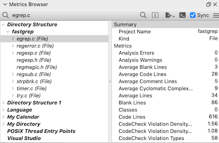
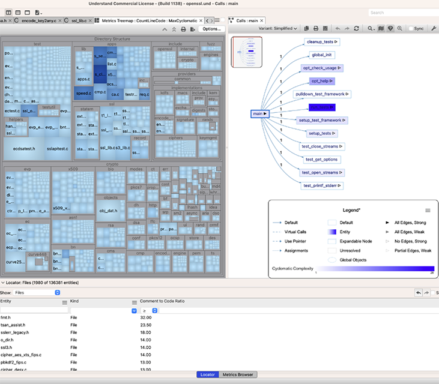
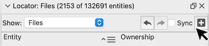
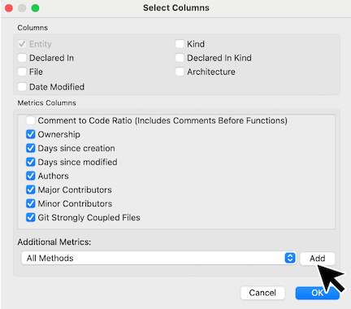
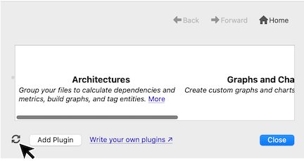
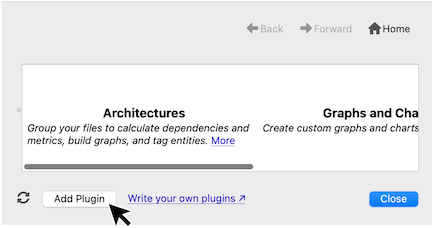

# Overview

Understand comes with a lot of built-in metrics, like the number of code lines or the McCabe cyclomatic complexity of a function. With the Python API metrics plugins you can add your own metrics as well! Not only can you view and export these values, but you can also use them in other Understand views. For example, you can shade the nodes in a call tree by cyclomatic complexity, find outliers with treemaps, or sort by metrics in the locator.

*A Control Flow graph shaded with the [Days Since Last Modified](und://plugin/metric/GitDaysSinceLastModified) metric*

## Viewing Metrics

The main way to view metric plugins is through the Metrics Browser (Metrics -> Browse Metrics). Only enabled metrics available for the selected entity or architeture are shown. Built-in metrics are enabled per project through Project -> Configure Project -> Metrics. Plugin metrics are enabled globally through the plugin manager. Project level metrics can only be retrieved through the API.

### Other Understand Views

*A Metric’s Treemap for OpenSSL with size by lines of code and coloring by maximum cyclomatic complexity. A Call Tree with nodes colored by cyclomatic complexity. The Entity Locator showing the Comment to Code Ratio.*

- Open a Metrics Treemap from Metrics -> Metrics Treemap.
- Apply a metric color scale to supported graphs following the directions in the [support article &#8599;](https://support.scitools.com/support/solutions/articles/70000641315-customizing-understand-s-graphs).
- Add metric columns to the Entity Locator (View -> Entity Locator) with the "Add Columns" icon.

## Writing Your Own Plugins

A metric plugin script can define multiple metrics. So related metrics such as all the [Coverage](und://plugins/Metric/.doc/manager_metrics.md?filter=Kind%3A%22Metric%22%20Solution%3A%22Coverage%22) or [Halstead](und://plugins/Metric/.doc/manager_metrics.md?filter=Kind%3A%22Metric%22%20Solution%3A%22Halstead%20Metrics%22) metrics are often grouped in the same file. The [Legacy](und://plugins/Metric/.doc/manager_metrics.md?filter=Kind%3A%22Metric%22%20Tags%3A%22Legacy%22) metrics are all defined in the sample template shown in the [Understand Python API Documentation &#8599;](https://docs.scitools.com/manuals/python/metric.html). Customize one of them to copy the template. There is also a [tutorial &#8599;](https://scitools.freshdesk.com/support/solutions/articles/70000582855) on writing scripts. Note that the Metrics Browser calculates all metrics for the selected entity or architecture before displaying any of them so enabling long running metrics can increase the wait time.

### Plugin Developper Tips

1. Any time a change is made to a plugin file, the plugin scripts cache must be refreshed using the "Refresh" button in the bottom left of the plugin manager.

2. When using "Customize" to make a new metric plugin, make sure to provide new ids so that it does not clash with the existing metric plugins. A customized plugin will not appear in the Plugin Manager until scripts have been refreshed, and must be enabled to be accessible from the Understand GUI. A plugin will only be visible in the Plugin Manager if it had no syntax errors.
3. To install a plugin from another location, use the "Add Plugin" button at the bottom left of the Plugin Manager. Or drag and drop the file onto Understand.

4. Understand uses the [per-interpreter GIL feature &#8599;](https://peps.python.org/pep-0684/) that was introduced in Python 3.12 to allow multiple threads to access their own Python interpreter concurrently. The per-interpreter GIL configuration is incompatible with modules that use [single-phase initialization  &#8599;](https://docs.python.org/3/c-api/module.html#single-phase-initialization). This means that plugins should only import native modules that support multi-phase initialization.

