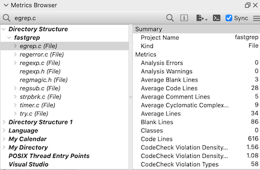
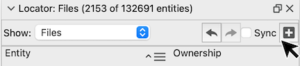

# 概要

Understand には、コード行数や関数の McCabe サイクロマチック複雑度のような多数の組み込みメトリクスが付属しています。Python API のメトリクス用プラグインを使えば、独自のメトリクスを追加することもできます。これらの値は表示やエクスポートができるだけでなく、ほかの Understand のビューでも活用できます。たとえば、呼び出しツリーのノードをサイクロマチック複雑度で色分けしたり、ツリーマップで外れ値を見つけたり、エンティティロケーターでメトリクスを使って並べ替えたりできます。

*[Days Since Last Modified](und://plugin/metric/GitDaysSinceLastModified) メトリクスで着色されたコントロールフローグラフ*

## メトリクスの表示

メトリクスプラグインを表示する主な方法は、「メトリクス」 -> 「メトリクス ブラウザー」 です。選択したエンティティまたはアーキテクチャで利用可能かつ有効化されているメトリクスのみが表示されます。ビルトイン メトリクスは、「プロジェクト」 -> 「プロジェクトの設定」 -> 「メトリクス」 からプロジェクト単位で有効化します。プラグインのメトリクスは「プラグインの管理」からグローバルに有効化します。プロジェクトレベルのメトリクスは API を通じてのみ取得できます。

### 他の機能での表示

*OpenSSL のメトリクス ツリーマップ（サイズはコード行数、色分けは最大サイクロマチック複雑度）。サイクロマチック複雑度でノードが色分けされたコールツリー。Comment to Code Ratio（コード行に占めるコメント行の割合）を表示するエンティティロケーター。*

- 「メトリクス」 -> 「メトリクス ツリーマップ」からメトリクス ツリーマップを表示します。
- 対応しているグラフにメトリクスのカラースケールを適用するには、[サポート記事 &#8599;](https://support.scitools.com/support/solutions/articles/70000641315-customizing-understand-s-graphs)の手順に従ってください。
- エンティティロケーター（「表示」 -> 「エンティティ ロケーター」）でメトリクスの列を追加するには「列の追加」アイコンから行います。

## 独自のプラグインを作成する

メトリクスプラグインのスクリプトは複数のメトリクスを定義できます。そのため、[Coverage](und://plugins/Metric/.doc/manager_metrics.md?filter=Kind%3A%22Metric%22%20Solution%3A%22Coverage%22) や [Halstead](und://plugins/Metric/.doc/manager_metrics.md?filter=Kind%3A%22Metric%22%20Solution%3A%22Halstead%20Metrics%22) など関連するメトリクスは同じファイルにまとめられることがよくあります。[Legacy](und://plugins/Metric/.doc/manager_metrics.md?filter=Kind%3A%22Metric%22%20Tags%3A%22Legacy%22) メトリクスは、[Understand Python API Documentation &#8599;](https://docs.scitools.com/manuals/python/metric.html) に示されているサンプルテンプレートで一括定義されています。テンプレートをコピーするには、そのうちの一つをカスタマイズします。スクリプト作成に関する [チュートリアル &#8599;](https://understand.techmatrix.jp/understand-70-pythonapi-tutorial-1/) もあります。なお、「メトリクス ブラウザー」 は、いずれかのメトリクスを表示する前に、選択したエンティティまたはアーキテクチャのすべてのメトリクスを計算します。そのため、実行時間の長いメトリクスを有効化すると待ち時間が増加します。

### カスタムプラグイン作成時のヒント

1. プラグインファイルに変更を加えた場合は、その都度、プラグインの管理の左下にある「更新」ボタンを使ってプラグインスクリプトのキャッシュを更新する必要があります。

2. 「カスタマイズ」を使って新しいプラグインを作成する際は、既存のアーキテクチャ・プラグインと衝突しないよう、新しい別の名前を付ける必要があります。カスタマイズしたプラグインは、スクリプトを更新するまでプラグインの管理に表示されません。また、Understand の GUI からアクセスできるようにするには有効化する必要があります。さらに、プラグインに文法エラーがある場合はプラグインの管理に表示されません。
3. 別の場所からプラグインをインストールするには、プラグインの管理の左下の「プラグインの追加」ボタンを使用するか、ファイルを Understand にドラッグ＆ドロップします。

4. Understand は、Python 3.12 で導入された [per-interpreter GIL feature &#8599;](https://peps.python.org/pep-0684/) を利用して、複数のスレッドがそれぞれ自分専用の Python インタプリタに同時にアクセスできるようにしています。per-interpreter GIL の構成は [single-phase initialization  &#8599;](https://docs.python.org/3/c-api/module.html#single-phase-initialization) を使用するモジュールとは互換性がありません。つまり、プラグインではマルチフェーズ初期化をサポートするネイティブモジュールのみをインポートする必要があります。

