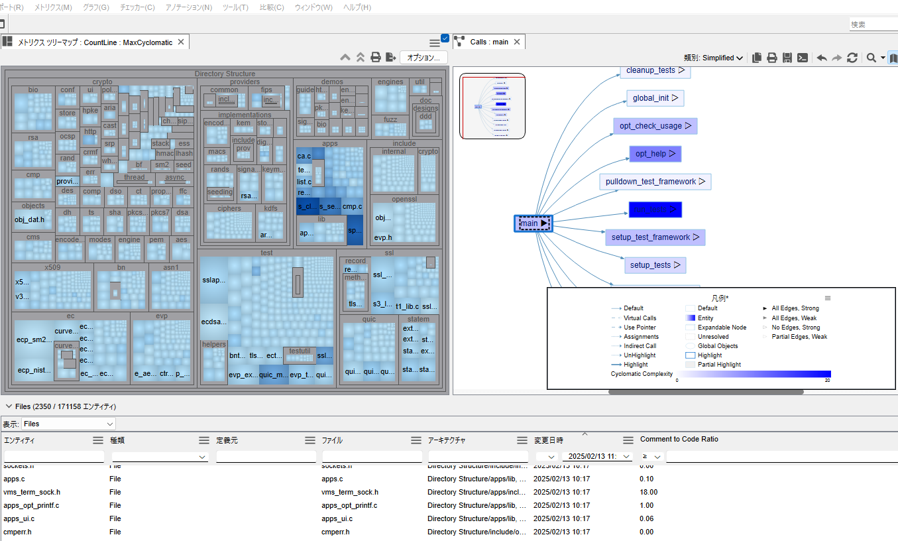

# メトリクス

Understandには、コード行数や関数のMcCabeのサイクロマティック複雑度など、多くのビルトインメトリクスが含まれています。Python API メトリクスプラグインを使用すれば、自分自身のメトリクスを追加することもできます。 
これらの値を表示、エクスポートするだけでなく、他のUnderstandビューでも使用することができます。 
例えば、コールツリーのノードをサイクロマティック複雑度によって色分けしたり、ツリーマップで異常値を見つけたり、エンティティ ロケーターでメトリクスによって並べ替えたりすることができます。

  
*OpenSSLのコード行数によるサイズと循環的複雑度の最大値による色分けをしたメトリクスツリーマップ。サイクロマティック複雑度によってノードが色分けされたコールツリーグラフ。コメントとコードの比率を表示するエンティティ ロケーター。*

# サンプルプラグイン
 - Git関連のメトリクスを見つけます。例えば、コミット数やファイルやフォルダーごとのユニークな作成者数からコードの変更頻度を確認できます。
 - カバレッジ メトリクスを使用して、LCOV情報ファイルからテストカバレッジ情報を含めることができます。
 - Halstead保守容易性メトリクスを計算します。

いくつかのメトリクスIDはUnderstand 6.4で変更されました。もしスクリプトが古いメトリクスIDに依存している場合でも問題ありません。compatability6-3.upy.renameというファイルをcompatability6-3.upyにリネームして実行するだけで、すべての旧メトリクスIDをプロジェクトで使用できるようになります。
このスクリプトは、カスタムプラグインのテンプレートとしても有用です。

## パフォーマンス
Understand GUIは、バックグラウンドでメトリクスを計算するようになりました。そのため、Gitの変更頻度メトリクスのような長時間実行されるメトリクスでもUIが遅くなることはありません。ただし、生成には時間がかかることになるので、使用する際には注意が必要です。
メトリクス ブラウザーは、選択したエンティティやアーキテクチャのすべてのメトリクスを表示する前に計算するため、長時間実行されるメトリクスをインストールすると待ち時間が増加する可能性があります。