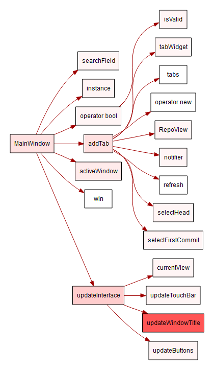
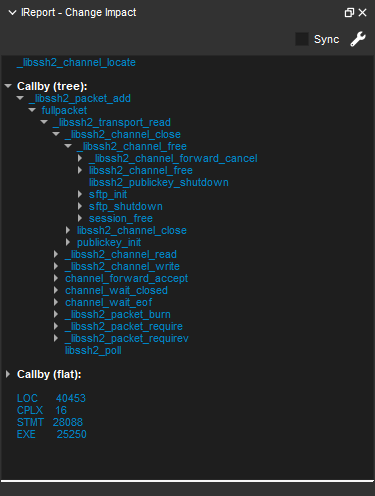
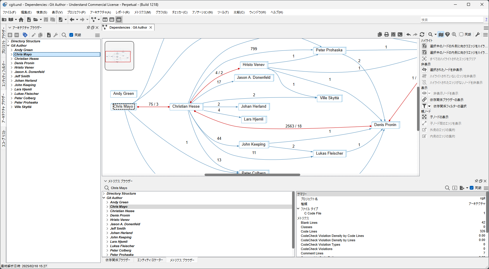
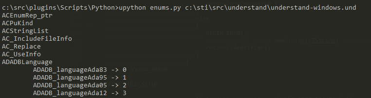

# Understand プラグイン

[Understand](https://www.techmatrix.co.jp/product/understand/) は、コードのメンテナンスと探索のために設計された強力な静的解析ツールです。コードとそのすべての相互関係に関する広範なデータベースを作成します。Understand IDEはその情報の多くを直接表示しますが、Pythonの拡張可能なプラグインシステムも備えており、チームの情報をもっとも意味のある方法で収集し表示することができます。 Understandは以下の４種類のプラグインをサポートしています: グラフ、インタラクティブ レポート、メトリクス、スクリプト

最新のドキュメントはUnderstandのヘルプメニューからアクセスできます。[ヘルプ] -> [Python API ヘルプ]を選択してください。

## グラフ プラグイン
グラフ プラグインを使用すると、Understandデータベースの情報を活用して、自身にとって重要なグラフを作成することができます。例えば、このプラグインは関数の複雑度に基づいて色が変わるコールツリーグラフを作成します。グラフはUnderstand内で直接アクセスすることも、スクリプト プラグインを通じて一括でエクスポートすることもできます。 

## インタラクティブ レポート
インタラクティブ レポート プラグイン（IReports）は、Understand内の指定されたエンティティ、アーキテクチャ、またはプロジェクト全体に対してクエリを実行したり、情報を収集したりすることができます。例えば、以下のChange Impactレポートは、関数を変更することがどの程度の影響を及ぼすかを予測することができます。この関数を変更すると、40,000行以上のコードに影響を与えることがわかります。

## 自動アーキテクチャ
自動アーキテクチャプラグインは、Understandプロジェクトを開くたびに実行されるPythonスクリプトです。これにより、独自のアーキテクチャを簡単に作成し、自動的に更新することができます。

## スクリプト
Understandデータベースに直接クエリを実行することも可能です。PythonのAPIスクリプトを使用して、これを実現できます。これらのスクリプトはGUI内から実行することも、コマンドラインから実行することもでき、バッチ処理やDevOpsの統合に非常に適しています。これらのスクリプトをJenkins CIパイプラインの一部として利用することもできます。
この簡単な例では、コマンドラインからプロジェクト内のすべてのenum（列挙型）をリストします。

