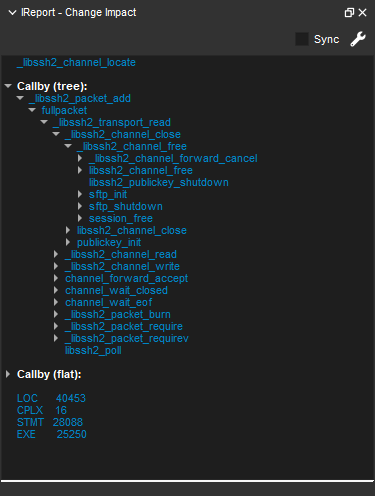
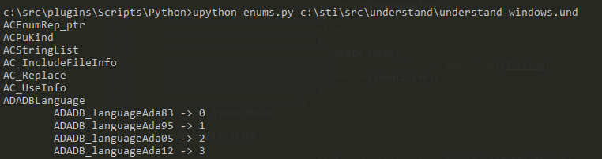

# Understand Plugins

[Understand](www.scitools.com) is a powerful static analysis tool designed for code maintenance and exploration. It creates an extensive database about your code and how everything is interconnected. The Understand IDE shows you a lot of that information directly, but it also has fully extensible plugin systems for Python and Perl to let you gather and display your team's information in the most meaningful way. Understand supports four flavors of plugins: [Graphs](https://github.com/stinb/plugins/tree/main/Graph), [Interactive Reports](https://github.com/stinb/plugins/tree/main/IReport), [CodeChecks](https://github.com/stinb/plugins/tree/main/CodeCheck) and [Scripts](https://github.com/stinb/plugins/tree/main/Scripts/Python).

Checkout the [API tutorials](https://scitools.freshdesk.com/en/support/solutions/articles/70000582855) for more help writing your own plugins.
The most up-to-date documentation is accessible from the Help menu in Understand. Select Help->Python API Documentation. You can also [access it here](https://docs.scitools.com/manuals/python/index.html).

## Graph Plugins
With a graph plugin you can leverage the information in the Understand database to create graphs of what is important to you. For example, this plugin creates a call tree graph that changes the color based on the complexity of the function. Graphs can be accessed directly in Understand or exported en masse via a script plugin. Check out the [README file](https://github.com/stinb/plugins/blob/main/Graph/README.md) in the Graph folder for more details.  

## Interactive Reports
Interactive report plugins, or IReports, let you run queries or gather information on a specified entity in Understand, from Architectures, or from the project as a whole. For example, the below Change Impact IReport lets you project how much impact changing a function will have, I can see that modifying this function will affect more than 40,000 lines of code.  

## CodeCheck Plugins
The CodeCheck feature in Understand has hundreds of checks yous can run against your code to validate coding standards and look for issues and vulnerabilities. The Python API makes it easy to [write your own checks](https://github.com/stinb/plugins/blob/main/CodeCheck/README.md) as well, like this one we use to enforce our internal parenthesis standard.
  

## Automatic Architectures
Automatic architecture plugins are Python scripts that get run every time you open your Understand project. They allow you to easily create your own architectures that are automatically updated

## Scripts
You can also query the Understand DB directly with Python and Perl API scripts. You can run these scripts from inside the GUI or from the command line, which lends itself well to batch processes or DevOps integration. We use these scripts heavily as part of our Jenkins CI Pipeline.
In this trivial example, I list all of the enums in my project from the command line.

## Contributing

We welcome contributions from the community! 
If you would like to contribute to this project, please follow the guidelines below:

1. Fork the repository and clone it to your local machine.
2. Create a new branch for your feature or bug fix: `git checkout -b feature/your-feature-name`.
3. Make your modifications and ensure that the project still runs successfully.
4. Commit your changes: `git commit -m 'Add your commit message here'`.
5. Push to the branch: `git push origin feature/your-feature-name`.
6. Open a pull request in this repository, providing a clear description of your changes and their purpose.

Alternatively, for individual scripts, feel free to send them to support@scitools.com and we can add them for you.

Please note the following guidelines:
- Follow the existing code style and naming conventions.
- Write clear and concise commit messages.
- Ensure your code changes are well-documented.
- Test your modifications thoroughly.
