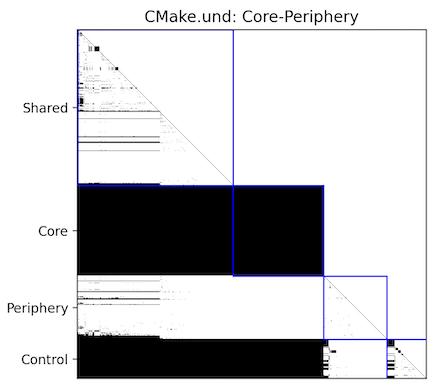

The goal of project quality is to assign a grade to a code-base. Ideally, this grade means something when comparing the project over time and/or against other projects. This solution contains plugins based on research papers about grading projects.

*A matrix showing the dependency analysis done by the [Visibility Matrix](und://plugin/arch/Visibility%20Matrix) architecture.*

# Comparing Different Projects

The software CBR-Insight[1] grades projects by comparing them to similar projects found on GitHub. This involves defining a set of metrics, calculating the values for many projects, finding similar projects, and then comparing the values. The final score is the percentile of the target project relative to the similar projects. Understand plugins support calculating the metrics used to compare against other projects.

The three areas scored are:
1. Architecture
2. Complexity
3. Clarity

There is an [interactive report](und://plugin/ireport/Project%20Quality%20%28CBRI%29) that shows the metrics contributing to each score. More details on the metrics and scoring are below.

## Architecture Score

The architecture score is a measure of software modularity. It is calculated from two metrics as `(1-CoreSize) + (1-PropagationCost)` where both CoreSize and PropagationCost are percentages. The corresponding metric plugins are [CorePercentage](und://plugin/metric/CorePercentage) and [PropagationCost](und://plugin/metric/PropagationCost).

### Dependency Networks

Both `CoreSize` and `Propagation Cost` come from research on dependency networks [2]. There is more context on these metrics below. Briefly, the core percentage is the percentage of files in the largest cyclical dependency group. The propagation cost is the percentage of direct or indirect file dependencies out of the number of possible file dependencies.

#### Dependency Matrices

In the dependency network analysis [2], dependencies are first plotted in a matrix with files on the axis. If a file directly or indirectly depends on another file, the value at the matrix is true. The inclusion of indirect dependencies makes the matrix a "Visibility" matrix. The following metrics can be calculated from the matrix:

- [Visible Fan In](und://plugin/metric/VisibleFanIn) the number of files that directly or indrectly depend on the target file. This is the sum of the file's column.
- [Visible Fan Out](und://plugin/metric/VisibleFanOut) the number of files the target file directly or indrectly depends on. This is the sum of the file's row.
- [Propagation Cost](und://plugin/metric/PropagationCost) the density of the matrix expressed as a percentage. This is a measure of how hard it is to modify the project.

There are also versions of the above metrics that consider only direct dependencies: [Direct Fan In](und://plugin/metric/DirectFanIn), [Direct Fan Out](und://plugin/metric/DirectFanOut), and [Direct Propagation Cost](und://plugin/metric/DirPropagationCost).

#### Project Classification

The authors found that plotting the Visible Fan In and Visible Fan Out values revealed a pattern.

The "Core" is the largest cyclical group in the project. There are metrics for the [number](und://plugin/metric/CoreSize) and [percentage](und://plugin/metric/CorePercentage) of files in the core. The [Visibility Matrix Cores](und://plugin/arch/Visibility%20Matrix%20Cores) architecture can be used to find all the cyclical groups in the project.

Most projects were "Core-Periphery" projects with a single core and periphery files. However, not all projects have a clear single core. "Hierarchical" projects  have no core and "Multi-Core" projects have more than one. "Multi-Core" and "Hierarchical" project files are split into four groups using median visible fan metrics instead of the core's visible fan metrics. The [Visibility Matrix](und://plugin/arch/Visibility%20Matrix) architecture classifies the project and splits the files into the four groups.

## Complexity Score

The complexity score is measure of logical complexity within files. It is also calculated from two metrics as `(1 - PercentComplexFiles) + (1 - PercentDuplicateLOC)`. The corresponding metric plugins are [CBRIOverlyComplexFilesPercent](und://plugin/metric/CBRIOverlyComplexFilesPercent) and [DuplicateLinesOfCodePercent](und://plugin/metric/DuplicateLinesOfCodePercent).

### Overly Complex Files

A file is complex if it exceeds more than 3 of the following 5 thresholds:

- Lines of Code (LOC, [CBRIUsefulLOC](und://plugin/metric/CBRIUsefulLOC) ) > 200
- Number of Methods (WMC-Unweighted, [CBRIMaxWMC](und://plugin/metric/CBRIMaxWMC) ) > 12
- Sum Cyclomatic Complexity (WMC-McCabe, [CBRIMaxWMCM](und://plugin/metric/CBRIMaxWMCM) ) > 100
- Response For Class (RFC, methods defined + methods called, [CBRIMaxRFC](und://plugin/metric/CBRIMaxRFC) ) > 30
- Coupling Between Objects (CBO, [CBRIMaxCBO](und://plugin/metric/CBRIMaxCBO) ) > 8

The number of thresholds a file exceeds is the [CBRIThresholdViolations](und://plugin/metric/CBRIThresholdViolations) metric. The  [number](und://plugin/metric/CBRIOverlyComplexFiles) and [percentage](und://plugin/metric/CBRIOverlyComplexFilesPercent) of files that exceed at more than 3 of the thresholds are also available.

### Duplicate Lines of Code

The duplicate lines of code [number](und://plugin/metric/DuplicateLinesOfCode) and [percentage](und://plugin/metric/DuplicateLinesOfCodePercent) metrics differ from the one used by CBR-Insight. The current algorithm was designed to handle multiple overlapping regions of duplicate code:

There are more details on the algorithm in the [Duplicate Lines of Code &#8599;](https://blog.scitools.com/duplicate-lines-of-code/) blog article. In addition to using a different detection algorithm, CBR-Insight also only considered "useful" lines of code which excluding lines that contained only punctuation (see [CBRIUsefulLOC](und://plugin/metric/CBRIUsefulLOC) ) and "useful" comment lines which excludes comments about licensing and commented out code. (see [CBRIUsefulComments](und://plugin/metric/CBRIUsefulComments) ).

To manipulate the minimum number of lines, or limit the results to only part of the project, run the Duplicate Lines of Code [interactive report](und://plugin/ireport/Duplicate%20Lines%20of%20Code) or the codecheck to populate the metric.

## Clarity Score

The clarity score is a measure of how simple and readable the code is. It usees only one metric `UsefulCommentDensity` and, in CBR-Insight, can include a score from manual review. The Understand metric plugin is [CBRIUsefulCommentToCodeRatio](und://plugin/metric/CBRIUsefulCommentToCodeRatio), defined as the ratio of [CBRIUsefulComments](und://plugin/metric/CBRIUsefulComments) to [CBRIUsefulLOC](und://plugin/metric/CBRIUsefulLOC).

# References

1. Ludwig, Jeremy, Devin Cline, and Aaron Novstrup. "A case study using CBR-insight to visualize source code quality." 2020 IEEE Aerospace Conference. IEEE, 2020.
2. Baldwin, Carliss, Alan MacCormack, and John Rusnak. "Hidden structure: Using network methods to map system architecture." Research Policy 43.8 (2014): 1381-1397.

There are also Understand blog articles with more information:

- [Overly Complex Files &#8599;](https://blog.scitools.com/overly-complex-files/) describes CBR-Insight
- [Dependency Networks With Understand &#8599;](https://blog.scitools.com/dependency-networks-with-understand/) describes dependency networks
- [Duplicate Lines of Code &#8599;](https://blog.scitools.com/duplicate-lines-of-code/) describes how duplicate lines of code are calculated
