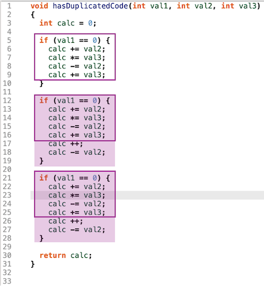

プロジェクト品質の目標は、コードベースで評価することです。理想的には、この評価は時間経過による比較や他プロジェクトとの比較において意味を持つべきです。本ソリューションには、プロジェクトの評価に関する研究論文に基づいたプラグインが含まれています。

## 複雑性スコア

複雑性スコアは、ファイル内の論理的な複雑さを測定する指標です。これは、`(1 - PercentComplexFiles) + (1 - PercentDuplicateLOC)` という式で計算されます。対応するメトリクスプラグインは [CBRIOverlyComplexFilesPercent](und://plugin/metric/CBRIOverlyComplexFilesPercent) と [DuplicateLinesOfCodePercent](und://plugin/metric/DuplicateLinesOfCodePercent) です。

### 過度に複雑なファイル

ファイルが次の5つの閾値のうち3つ以上を超える場合、そのファイルは複雑であると見なされます。

- コード行数 (LOC, [CBRIUsefulLOC](und://plugin/metric/CBRIUsefulLOC) ) > 200
- メソッド数 (WMC-非加重, [CBRIMaxWMC](und://plugin/metric/CBRIMaxWMC) ) > 12
- サイクロマティック複雑度の合計 (WMC-McCabe, [CBRIMaxWMCM](und://plugin/metric/CBRIMaxWMCM) ) > 100
- クラスの応答 (RFC, 定義されたメソッド + 呼び出されたメソッド, [CBRIMaxRFC](und://plugin/metric/CBRIMaxRFC) ) > 30
- オブジェクト間結合 (CBO, [CBRIMaxCBO](und://plugin/metric/CBRIMaxCBO) ) > 8

ファイルが超えた閾値の数は [CBRIThresholdViolations](und://plugin/metric/CBRIThresholdViolations) メトリクスで表されます。また、3つ以上の閾値を超えたファイルの[数](und://plugin/metric/CBRIOverlyComplexFiles)や[割合](und://plugin/metric/CBRIOverlyComplexFilesPercent)も利用可能です。

### 重複コード行

重複コード行の[数](und://plugin/metric/DuplicateLinesOfCode)や[割合](und://plugin/metric/DuplicateLinesOfCodePercent)メトリクスは、CBR-Insightで使用されるものとは異なります。現在のアルゴリズムは、重複コードの複数の重なり領域を処理するよう設計されています。

アルゴリズムの詳細については、[Duplicate Lines of Code &#8599;](https://blog.scitools.com/duplicate-lines-of-code/) ブログ記事をご参照ください。さらに、CBR-Insightでは、コードの「有用な」行のみを考慮しており、句読点のみを含む行（[CBRIUsefulLOC](und://plugin/metric/CBRIUsefulLOC) を参照）やライセンスに関するコメント、コメントアウトされたコードを除外しています（[CBRIUsefulComments](und://plugin/metric/CBRIUsefulComments) を参照）。

最小行数を操作したり、プロジェクトの一部のみに結果を制限するには、重複コード行の[インタラクティブレポート](und://plugin/ireport/Duplicate%20Lines%20of%20Code)を実行してメトリクスを生成してください。

## 明瞭性スコア

明瞭性スコアは、コードがどれだけシンプルで読みやすいかを測定する指標です。これは1つのメトリクス `UsefulCommentDensity` のみを使用し、CBR-Insightでは手動レビューによるスコアを含めることができます。Understandメトリクスプラグインは [CBRIUsefulCommentToCodeRatio](und://plugin/metric/CBRIUsefulCommentToCodeRatio) であり、[CBRIUsefulComments](und://plugin/metric/CBRIUsefulComments) を [CBRIUsefulLOC](und://plugin/metric/CBRIUsefulLOC) で割った比率として定義されます。

# 参考文献

1. Ludwig, Jeremy, Devin Cline, and Aaron Novstrup. "A case study using CBR-insight to visualize source code quality." 2020 IEEE Aerospace Conference. IEEE, 2020.
2. Baldwin, Carliss, Alan MacCormack, and John Rusnak. "Hidden structure: Using network methods to map system architecture." Research Policy 43.8 (2014): 1381-1397.

また、以下のUnderstandブログ記事にも詳細があります：

- [Overly Complex Files &#8599;](https://blog.scitools.com/overly-complex-files/) はCBR-Insightについて説明しています。
- [Dependency Networks With Understand &#8599;](https://blog.scitools.com/dependency-networks-with-understand/) は依存関係ネットワークについて説明しています。
- [Duplicate Lines of Code &#8599;](https://blog.scitools.com/duplicate-lines-of-code/) は重複コード行の計算方法について説明しています。