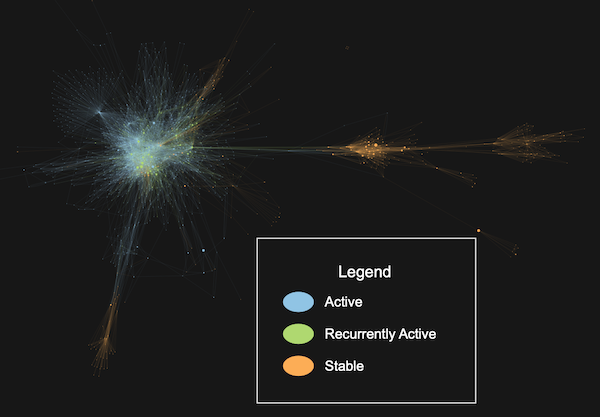
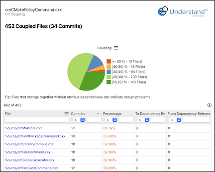

# Authors

Authors can be broken into three categories [1]:

- Owner: the author(s) with the most commits
- Major Contributor: at least 5% of the commits
- Minor Contributor: less than 5% of the commits

**Technical Debt Tip:** Files with strong ownership are preferred, and files with many minor contributors are more bug prone. [1,2]

## Plugins

Check out the [Git Authors](und://plugin/ireport/Git%20Authors) interactive report for an overview. Create architectures to group by [author](und://plugin/arch/Git%20Author) or [owner](und://plugin/arch/Git%20Owner). Use metrics to calculate the [number of authors](und://plugin/metric/GitAuthors),
the [number of major contributors](und://plugin/metric/GitMajorContributors), the [number of minor contributors](und://plugin/metric/GitMinorContributors), and the [ownership](und://plugin/metric/GitOwnership) (the percentage of commits made by the owner).

# Churn

Files can be classified as:

- Active: Modified at least twice in the last 30 days.
- Recurrently Active: Active for multiple 30 day periods.
- Stable: Not meeting the criteria for active or recurrently active.

**Technical Debt Tip:** Recurrently active files can be a sign that a file is poorly designed or has many bugs. [2,3]

## Plugins

Tag "Recurrently Active" files with the [Git Stability](und://plugin/arch/Git%20Stability) architecture. You can also group files by when they were last modified with the [Git Date](und://plugin/arch/Git%20Date) architecture. Summarize commits with the [Git Commits](und://plugin/ireport/Git%20Commits) interactive report. Use metrics to see the [number of commits](und://plugin/metric/GitCommits) and the [first](und://plugin/metric/GitDaysSinceCreated) and [last](und://plugin/metric/GitDaysSinceLastModified) date. The last date metric is also available as a line metric, so it can be used to color Control Flow graphs.

# Coupling and Cohesion

A file is coupled to another file through Git if they are both modified in the same commit. The coupling is measured by the number of commits the two files co-occur in divided by the number of commits for the target file.

**Technical Debt Tip:** Check coupled files for unwanted dependencies, such as copy-paste code.

## Plugins

Check out the [Git Coupling](und://plugin/ireport/Git%20Coupling) interactive report to find coupled files and quickly check dependencies. You can also graph coupling relationships similar to file dependency relationships with the [Git Coupling Graph](und://plugin/graph/Git%20Coupling-Custom). There are also coupling metrics: [Git Coupled Files](und://plugin/metric/GitCoupledFiles), [Git Strongly Coupled Files](und://plugin/metric/GitStrongCoupledFiles), [Git Average Coupling](und://plugin/metric/GitAvgCoupling) and [Git Max Coupling](und://plugin/metric/GitMaxCoupling)

A related concept, cohesion, measures how commits cross architectures. Check out the [Git Cohesion](und://plugin/metric/GitCohesion) metric for details.

# References

1. Bird, Christian, et al. "Don't touch my code! Examining the effects of ownership on software quality." Proceedings of the 19th ACM SIGSOFT symposium and the 13th European conference on Foundations of software engineering. 2011.
2. Omeyer, Alexandre . 3 Technical Debt Metrics Every Engineer Should Know. 31 July 2019, www.stepsize.com/blog/use-research-from-industry-leaders-to-measure-technical-debt. Accessed 10 Mar. 2025.
3. Schulte, Lukas, Hitesh Sajnani, and Jacek Czerwonka. "Active files as a measure of software maintainability." Companion Proceedings of the 36th International Conference on Software Engineering. 2014.
4. Tornhill, Adam. Code as a Crime Scene. Nov. 2013, “Code as a Crime Scene.” Adamtornhill.com, 2024, www.adamtornhill.com/articles/crimescene/codeascrimescene.htm.. Accessed 10 Mar. 2025.

