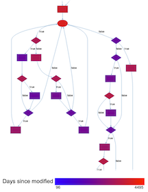
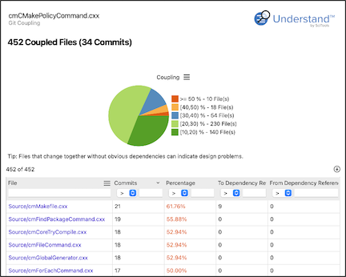

バージョン管理は、技術的負債に関する貴重な情報を以下の3つの広範なカテゴリで提供できます：作成者、変更頻度（コードチャーン）、および結合性。以下で各分野について詳しく説明します。

これらのプラグインはGitリポジトリから情報を読み取ります。また、これらのプラグインについて説明した[ブログ記事 &#8599;](https://blog.scitools.com/git-plugins-for-understand/)もあります。

*[Git Stability](und://plugin/arch/Git%20Stability)アーキテクチャから生成されたファイル依存関係グラフ*

# 作成者

作成者は以下の3つのカテゴリに分類されます[1]：

- Owner: 最も多くのコミットを行った貢献者
- Major Contributor: コミットの少なくとも5%を占める貢献者
- Minor Contributor: コミットの5%未満の貢献者

**技術的負債のヒント:** 強い所有権を持つファイルが望ましく、多くの副次的な貢献者を持つファイルはバグが多い傾向があります。[1,2]

## プラグイン

[Git Authors](und://plugin/ireport/Git%20Authors)インタラクティブレポートで概要を確認してください。[author](und://plugin/arch/Git%20Author)や[owner](und://plugin/arch/Git%20Owner)でグループ化するアーキテクチャを作成します。[number of authors](und://plugin/metric/GitAuthors)、[number of major contributors](und://plugin/metric/GitMajorContributors)、[number of minor contributors](und://plugin/metric/GitMinorContributors)、および[ownership](und://plugin/metric/GitOwnership)（オーナーによるコミットの割合）を計算するメトリクスを使用します。

# 変更頻度（コードチャーン）

ファイルは以下のように分類されます：

- Active: 過去30日間に少なくとも2回変更されたファイル。
- Recurrently Active: 複数の30日間の期間でアクティブなファイル。
- Stable: ActiveまたはRecurrently Activeの基準を満たさないファイル。

**技術的負債のヒント:** Recurrently Activeのファイルは、設計が不十分であるか、多くのバグを含んでいる可能性があります。[2,3]

## プラグイン

[Git Stability](und://plugin/arch/Git%20Stability)アーキテクチャで"再帰的にアクティブ"なファイルにタグを付けます。[Git Date](und://plugin/arch/Git%20Date)アーキテクチャを使用して、最後に変更された時期でファイルをグループ化することもできます。[Git Commits](und://plugin/ireport/Git%20Commits)インタラクティブレポートでコミットを要約します。[コミット数](und://plugin/metric/GitCommits)、[作成日](und://plugin/metric/GitDaysSinceCreated)、および[最終変更日](und://plugin/metric/GitDaysSinceLastModified)を確認するメトリクスを使用します。最終変更日メトリクスはラインメトリクスとしても利用可能で、Control Flowグラフを色付けするために使用できます。

# 結合性と凝集性

ファイルは、同じコミットで両方が変更された場合、Gitを通じて他のファイルと結合されています。結合性は、2つのファイルが同じコミットで共起する回数をターゲットファイルのコミット数で割った値で測定されます。

**技術的負債のヒント:** 結合されたファイルに不要な依存関係（コピー＆ペーストコードなど）がないか確認してください。

## プラグイン

[Git Coupling](und://plugin/ireport/Git%20Coupling)インタラクティブレポートで結合されたファイルを確認し、依存関係を迅速にチェックします。[Git Coupling Graph](und://plugin/graph/Git%20Coupling-Custom)を使用して、ファイル依存関係に類似した結合関係をグラフ化することもできます。また、結合性メトリクスもあります：[Git Coupled Files](und://plugin/metric/GitCoupledFiles)、[Git Strongly Coupled Files](und://plugin/metric/GitStrongCoupledFiles)、[Git Average Coupling](und://plugin/metric/GitAvgCoupling)、および[Git Max Coupling](und://plugin/metric/GitMaxCoupling)。

関連する概念として、凝集性はコミットがどの程度アーキテクチャをまたいでいるかを測定します。[Git Cohesion](und://plugin/metric/GitCohesion)メトリクスを確認してください。

# 参考文献

1. Bird, Christian, et al. "Don't touch my code! Examining the effects of ownership on software quality." Proceedings of the 19th ACM SIGSOFT symposium and the 13th European conference on Foundations of software engineering. 2011.
2. Omeyer, Alexandre . 3 Technical Debt Metrics Every Engineer Should Know. 31 July 2019, www.stepsize.com/blog/use-research-from-industry-leaders-to-measure-technical-debt. Accessed 10 Mar. 2025.
3. Schulte, Lukas, Hitesh Sajnani, and Jacek Czerwonka. "Active files as a measure of software maintainability." Companion Proceedings of the 36th International Conference on Software Engineering. 2014.
4. Tornhill, Adam. Code as a Crime Scene. Nov. 2013, “Code as a Crime Scene.” Adamtornhill.com, 2024, www.adamtornhill.com/articles/crimescene/codeascrimescene.htm.. Accessed 10 Mar. 2025.