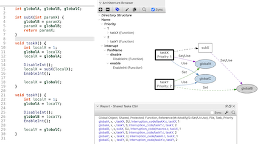

グローバル変数を含むコールグラフは、コールツリーによってアクセスされるすべてのグローバル変数を見つけるのに有用です。しかし、複数のコールツリー間で共有されているグローバル変数を特定したい場合はどうでしょうか？

アーキテクチャは、コールツリーを定義するルート関数にタグを付けるために使用されます。その後、[グラフ化](und://plugin/graph/Shared%20Tasks-By%20Function)または[エクスポート](und://plugin/ireport/Shared%20Tasks%20CSV)することで、共有グローバル変数を見つけることができます。また、オブジェクトから開始して、[Shared Tasks - By Object](und://plugin/graph/Shared%20Tasks-By%20Object)グラフを使用してルート関数を見つけることも可能です。

## アーキテクチャ構造

複数のコールツリーを扱うということは、複数のルート関数を扱うことを意味します。プラグインに複数のエンティティを渡すには、エンティティをアーキテクチャ内でグループ化する必要があります。シンプルなアーキテクチャは以下の形式を持つことができます：

- ルートアーキテクチャの名前は任意
  - `tasks`という単語を含む任意の名前（大文字小文字を区別しない）
    - function1()
    - function2()

共有タスクプラグインは、タスクの追加フィールドもサポートしています。これらのフィールドは、タスク名の下のグラフや、テーブル内の列として表示されます。現在サポートされているフィールドは「core」と「priority」です。フィールドは、`tasks`という単語を含むアーキテクチャ名の代わりに使用できます。

- ルートアーキテクチャの名前は任意
  - `core`または`priority`という単語を含む任意の名前（大文字小文字を区別しない）
    - フィールド値（例: 1）
      - function1()
    - 別のフィールド値（例: 2）
      - function2()

最後に、アーキテクチャは割り込みを有効化および無効化する関数を識別するために使用できます。これらの関数によって保護された参照（無効化関数の呼び出しの後、かつ有効化関数の呼び出しの前に続く）は、プラグインによって識別されます。割り込み制御の命名パターンは以下の通りです（tasksは省略）：

- ルートアーキテクチャの名前は任意
  - `interrupt`または`control`という単語を含む名前（大文字小文字を区別しない）
    - 任意の名前。このレイヤーでは複数の割り込み関数ペアを許可します。
      - enable
        - enableFunction()
      - disable
        - disableFunction()

詳細は、２つのブログ記事[Finding Shared Global Objects &#8599;](https://blog.scitools.com/finding-shared-global-objects/)と[Visualizing Shared Tasks &#8599;](https://blog.scitools.com/visualizing-shared-tasks/)を参照ください。また、[concurrency](und://plugins?filter=Tags%3A%22Concurrency%22)プラグインも確認してください。