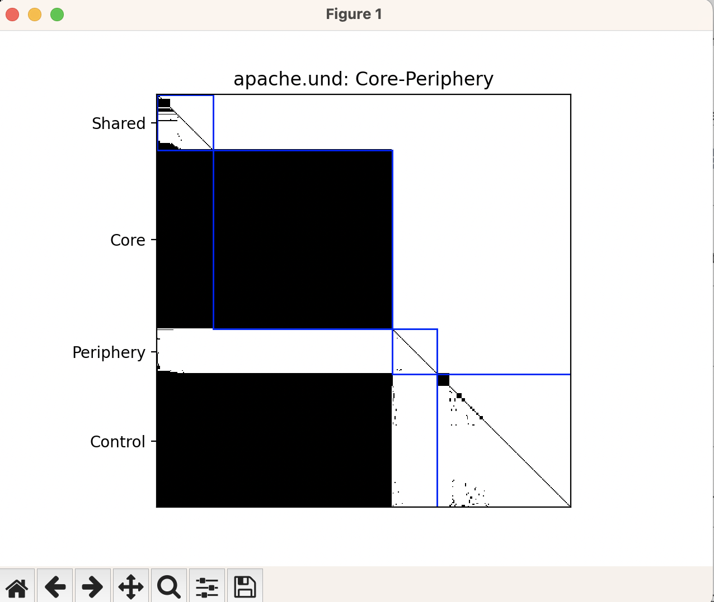

# The Research

The research paper [“Hidden Structure: Using Network Methods to Map Product Architecture”](https://dash.harvard.edu/handle/1/10646422) describes how to calculate a visibility matrix from a design structure matrix (DSM) representing dependencies. The matrices are used to calculate the file metrics:

* direct fan in (DFI)
* direct fan out (DFO)
* visible fan in (VFI)
* visible fan out (VFO)

The file metrics are then used to determine the architecture type of the software from:

* Core Periphery
* Borderline Core Periphery
* Multi Core
* Hierarchical

The architecture type together with the file VFO and VFI values are used to classify files into four categories:

* Shared
* Core
* Control
* Peripheral

The final matrix is sorted using these categories and displayed. 




Additional project metrics are:

* **propagation cost:** The density of the visibility matrix, representing the average number of files that would be impacted by changing a file at random.
* **core size** the number of files in the largest cyclic group

# The Scripts

The file [matrix.py](https://github.com/stinb/plugins/blob/main/Solutions/visibilityMatrix/matrix.py) generates a visibility matrix and the fan metrics for a set of entities using Understand's dependencies. Use the classify function to determine the architecture type and classify the files into groups. 

The files [metrics.upy](https://github.com/stinb/plugins/blob/main/Solutions/visibilityMatrix/metrics.upy), [arch.upy](https://github.com/stinb/plugins/blob/main/Solutions/visibilityMatrix/arch.upy), and [cores_arch.upy](https://github.com/stinb/plugins/blob/main/Solutions/visibilityMatrix/cores_arch.upy) are plugins for Understand. Note that they depend on [matrix.py](https://github.com/stinb/plugins/blob/main/Solutions/visibilityMatrix/matrix.py) so it's best to copy the whole folder to install the plugins. 

The file [generate.py](https://github.com/stinb/plugins/blob/main/Solutions/visibilityMatrix/generate.py) is a complete script to output information from matrix.py. By default, the script displays the resulting matrix with matplotlib. However, matplotlib is not available from the python interpreter shipped with Understand (upython). So to get the visual images, you'll need to [use Understand from your own python installation](https://support.scitools.com/support/solutions/articles/70000582852-getting-started-with-the-python-api). Alternatively, you can run the script from upython without generating graphics using the --noshow flag.

Generate and display the matrix. Summary metrics are printed to the command line.

```
python3 generate.py project.und
```

Normally the files categories are determined by the architecture type, with Core Periphery and Borderline Core Periphery using the VFI and VFO of the core group as cutoffs and the other two types using the median VFI and VFO as cutoffs. You can override this behavior with the strategy flag:

```
python3 generate.py project.und --strategy median
python3 generate.py project.und --strategy core
```

The files are sorted by category, then by descending VFI, and then by ascending VFO. You can change the order with the sort and sortdir flags, repeating them multiple times to get the "then by" effect. Sortdir defaults to ascending. Note that the boxes in the matplotlib figure showing the file categories are only shown if the first sort field is "class". The default sorting is equivalent to the following command:

```
python3 generate.py project.und --sort class --sortdir ascending --sort vfi --sortdir descending --sort vfo --sort filename
```

If you don't want the graphic, you can run generate from the interpreter shipped with Understand. Summary value are still printed to the command line.

```
upython generate.py project.und --noshow
```

You can also save the matrix and the metrics as csv files with the --matrixout and --metricsout flags. If no argument is given to the flags, stdout is used. So, the first two commands prints the file metrics to standard out, and the last two command saves them to the given file:

```
upython generate.py project.und --noshow --metricsout
python3 generate.py project.und --metricsout

upython generate.py project.und --noshow --metricsout output.csv
python3 generate.py project.und --metricsout output.csv
```
